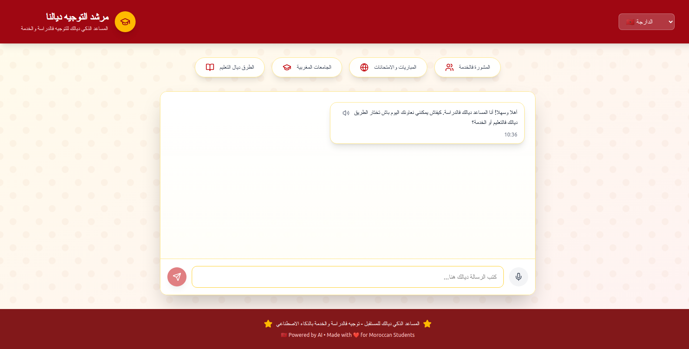

# 🎓 Moroccan Academic Guidance Chatbot



<div align="center">

[](https://reactjs.org/)
[](https://tailwindcss.com/)
[](https://github.com/SALAH-NAME/repo_khawi)

**Your intelligent assistant for educational and career guidance in Morocco**

[🛠️ Installation](#installation) • [🤝 Contributing](#contributing)

</div>

---

## 🌟 Overview

The **Moroccan Academic Guidance Chatbot** is an AI-powered conversational assistant designed to help Moroccan students navigate their educational journey. Built with modern web technologies, it provides personalized guidance for university choices, career paths, entrance exams, and academic planning.

### ✨ Key Features

- 🗣️ **Multi-language Support**: Arabic, French, English, and Moroccan Darija
- 🎤 **Voice Input & Output**: Speech recognition and text-to-speech capabilities
- 🏛️ **University Guidance**: Information about Moroccan universities and programs
- 📚 **Exam Preparation**: Guidance on entrance exams and competitions
- 💼 **Career Counseling**: Professional advice and career path recommendations
- 🎨 **Moroccan Design**: Beautiful UI inspired by Moroccan culture and colors
- 📱 **Responsive Design**: Works seamlessly on desktop and mobile devices

## 🎯 Target Audience

- 🎓 High school students planning their university journey
- 👨‍🎓 University students exploring career options
- 👩‍🏫 Educators and counselors seeking guidance tools
- 👨‍👩‍👧‍👦 Parents supporting their children's educational decisions

## 🛠️ Technology Stack

- **Frontend**: React 18+ with Hooks
- **Styling**: Tailwind CSS with custom Moroccan-inspired themes
- **Icons**: Lucide React
- **Speech Recognition**: Web Speech API
- **Text-to-Speech**: Web Speech Synthesis API
- **Responsive Design**: Mobile-first approach

## 🚀 Getting Started

### Prerequisites

- Node.js (v16 or higher)
- Modern web browser with Speech API support

### Installation

1. **Clone the repository**
   ```bash
   git clone https://github.com/SALAH-NAME/repo_khawi.git
   cd repo_khawi
   ```

2. **Install dependencies**
   ```bash
   npm install
   ```

3. **Start the development server**
   ```bash
   npm start
   ```

4. **Open your browser**
   Navigate to `http://localhost:3000` to see the application running.

### Build for Production

```bash
npm run build
```

## 📖 Usage Guide

### Language Selection
- Choose from Arabic (العربية), French (Français), English, or Moroccan Darija (الدارجة)
- The interface automatically adjusts for RTL languages

### Chat Interface
- Type your questions in the input field
- Use the microphone button for voice input
- Click the speaker icon on bot responses to hear them aloud
- The bot provides contextual responses based on your language and queries

### Voice Features
- **Voice Input**: Click the microphone icon to start voice recognition
- **Voice Output**: Click the speaker icon next to bot responses to hear them
- Supports multiple languages with appropriate accents

## 🏗️ Project Structure

```
src/
├── components/
│   └── MoroccanChatBot.js    # Main chatbot component
├── styles/
│   └── index.css            # Global styles and Tailwind imports
├── utils/
│   └── translations.js      # Language translations
└── App.js                   # Root application component
```

## 🌍 Internationalization

The application supports four languages:

- **Arabic (العربية)**: Standard Arabic with RTL support
- **French (Français)**: Academic French terminology
- **English**: International English
- **Darija (الدارجة)**: Moroccan dialect

Each language has complete translations for:
- UI elements and navigation
- Bot responses and conversations
- Educational terminology
- Feature descriptions

## 🎨 Design Philosophy

The design draws inspiration from Moroccan culture:

- **Colors**: Red and amber representing the Moroccan flag
- **Patterns**: Subtle geometric patterns inspired by Islamic art
- **Typography**: Multi-script support for Arabic and Latin scripts
- **User Experience**: Intuitive and culturally appropriate interface

## 🤝 Contributing

We welcome contributions from the community! Here's how you can help:

### Ways to Contribute

1. **Bug Reports**: Report issues via GitHub Issues
2. **Feature Requests**: Suggest new features or improvements
3. **Code Contributions**: Submit pull requests with enhancements
4. **Translations**: Help improve language support
5. **Documentation**: Enhance documentation and guides

### Development Workflow

1. Fork the repository
2. Create a feature branch (`git checkout -b feature/amazing-feature`)
3. Make your changes
4. Test thoroughly
5. Commit your changes (`git commit -m 'Add amazing feature'`)
6. Push to your branch (`git push origin feature/amazing-feature`)
7. Open a Pull Request


---

<div align="center">

**Made with ❤️ for Moroccan Students** 🇲🇦

*Empowering the next generation through intelligent guidance*

[⬆ Back to Top](#-moroccan-academic-guidance-chatbot)

</div>
